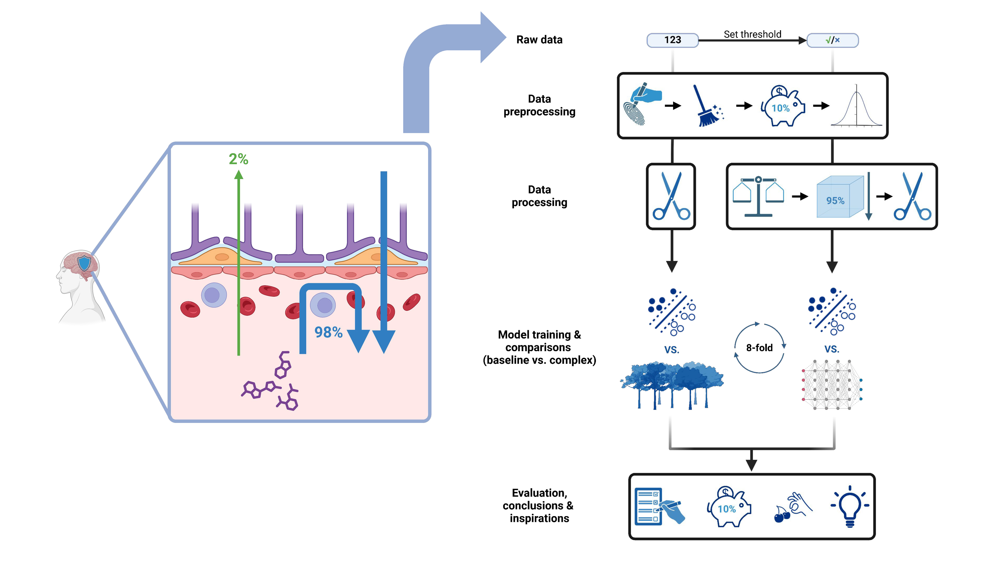

# BBBPrediction

This GitHub page demonstrates the development and the final presentation of
this project. We hope our project can inspire future drug development and 
mechanism studies of a chemical's ability to penetrate blood-brain 
barrier (BBB) for more efficient drug delivery and less systemic side effects.

## Graphical abstract

## Original datasets

Data source: Meng, F., Xi, Y., Huang, J. & Ayers, P. W. A curated diverse
molecular database of blood-brain barrier permeability with chemical
descriptors. Sci Data 8, 289 (2021). https://doi.org/10.1038/s41597-021-01069-5

* GitHub page: https://github.com/theochem/B3DB
* All .tsv were converted to .csv

\
2 datasets from the publication

|      Dataset files      |  Number of chemicals  | Number of BBB+ chemicals | Number of BBB- chemicals | Original number of descriptors |
|:-----------------------:|:---------------------:|:------------------------:|:------------------------:|:------------------------------:|
|   BBB_regression.csv    |         1058          |           930            |           128            |              1623              |
| BBB_classification.csv  |         7807          |           4956           |           2851           |              1625              |

* In BBB_regression.csv, `logBB <= -1.01` is considered as BBB-
  and `logBB >= -1` is considered as BBB+. Threshold is `-1`.

## Descriptors

Our **descriptors** directory contain the descriptors used in the original
datasets (not used in this project but saved for reference)

* **1623_regression_descriptors.txt**
* **1625_classification_descriptors.txt**

## Datasets (processed)

Our **datasets** directory structure:

* **original_datasets**: .tsv datasets directly from the publication
  * B3DB_regression.tsv
  * B3DB_classification.tsv
* **cleaned_datasets**: quick cleaned up datasets that only keep the SMILES
  and property to predict into .csv
  * BBB_regression.csv
  * BBB_classification.csv
* **expanded_datasets**: .csv.zip datasets that have been expanded by RDKit
  descriptors, Morgan fingerprints, and MACCS keys
  * BBB_regression_expanded.csv.zip <- This is the final dataset for
    regression models
  * BBB_classification_expanded.csv.zip
* **holdout_datasets**: After cleaning and expanding, they were divided into
  two groups. This dataset was reserved for post-training validation.
  * regression_df_expanded_cleaned_holdout.csv.zip
  * classification_df_expanded_cleaned_holdout.csv.zip
* **train_datasets**: These are the datasets used for training after the
  division.
  * regression_df_expanded_cleaned_train.csv.zip
    * Used for training regressors
  * classification_df_expanded_cleaned_train.csv.zip
    * Need further balancing
* **balanced_datasets**: These are the final datasets for
  classification models
  * BBB_classification_balanced_centroid.csv.zip
    * Later found out to be the better and more reliable balanced dataset
      for classifiers training
  * BBB_classification_balanced_smoteenn.csv.zip
* **cherry_picked_dataset**: dataset containing cherry-picked molecules for
  cherry-picking test
  * cherry_picked_molecules.csv

## Jupyter notebooks

Ordered by their indexes. Jupyter notebooks with the same index run in
parallel

* **0_data_preprocessing.ipynb**: This is where the datasets were cleaned,
  balanced, and a holdout set was separated out
* **1_baseline_models_training.ipynb**: The SVM and SVR models were trained
  here using a grid search
* **1_baseline_models_evaluation.ipynb**: The SVM and SVR models were
  evaluated
  using residuals, ROC, Delongs, etc.
* **2_complex_models_training.ipynb**: The Random Forest and Multilayer
  Perceptron were trained here using a grid search
* **2_complex_models_evaluation.ipynb**: The RF and MLP were evaluated using
  various validations, such as ROC and residuals.
* **3_models_comparisons.ipynb**: comparison of the baseline and complex
  models to find the best regressor and classifier using residuals, ROC,
  Delongs, etc.

## Python modules

Modules antinomianian constitute functions used in Jupyter notebooks

* **dataset_cleanup.py**: contains functions for cleaning up datasets
* **dataset_expansion.py**: contains functions for expanding the datasets
  with descriptors and fingerprints
* **dataset_plot.py**: contains functions for making pie chart to visualize
  the balancing of classification dataset
* **model_evaluation.py**: functions used in evaluating models, notably
  "Delong's Test"
* **pickle_managment.py**: functions used to help save and store models and
  other objects for future use

## Model outputs

Our **model_outputs** directory structure:

* **data_preprocessing**: Graphic representations of our data, as well as the
  effects of some processing.
  * regression_histrogram.png
  * classification_classes_counts.png
  * classification_before_balancing.png
  * classification_balanced_centroid.png
  * classification_balanced_smoteenn.png
* **svr_regressor**:These are pickles(saved data and objects) and graphics from
  the baseline regressor training and evaluation, including test sets, PCA
  components,
  and processing tools.
  * Data splits
    * regression_x_train.pkl
    * regression_x_test.pkl
    * regression_y_train.pkl
    * regression_y_test.pkl
  * Pipelines
    * svm_regressor_pipeline.pkl
  * Evaluation Graphics
    * metrics.png
    * pred_vs_actual.png
    * residuals.png
* **svm_classifier**: These are pickles(saved data and objects) and graphics
  from the baseline classifier training and evaluation, including test sets,
  PCA components,
  and processing tools.
  * Data splits
    * centroid_x_train.pkl
    * centroid_y_train.pkl
    * centroid_x_test.pkl
    * centroid_y_test.pkl
    * smoteenn_x_train.pkl
    * smoteenn_y_train.pkl
    * smoteenn_x_test.pkl
    * smoteenn_y_test.pkl
  * PCA Components
    * top_two_centroid.pkl
    * top_two_smoteenn.pkl
  * Pipelines
    * centroid_pipeline.pkl
    * smoteenn_pipeline.pkl
  * Evaluation Graphics
    * centroid_auroc.png
    * centroid_holdout_roc.png
    * centroid_metrics.png
    * smoteenn_auroc.png
    * smoteenn_holdout_roc.png
    * SMOTEENN_metrics.png
* **rf_regressor**: These are pickles(saved data and objects) and graphics
  from the complex regressor training and evaluation
  * Data splits
    * regression_X_test.pkl
    * regression_X_train.pkl
    * regression_y_test.pkl
    * regression_y_train.pkl
  * RF feature importance
    * importance_ranking_horizontal.png
    * importance_ranking_vertical.png
  * RF performance metrics
    * metrics.png
  * Residual analysis
    * pred_vs_actual.png
    * residuals.png
* **mlp_classifier**: These are pickles(saved data and objects) and graphics
  from the complex classifier training and evaluation
  * Data splits
    * classification_X_test.pkl
    * classification_X_train.pkl
    * classification_y_test.pkl
    * classification_y_train.pkl
  * MLP performance
    * auroc.png
    * loss_curve.png
    * metrics.png
* **model_comparisons**: These are pickles(saved data and objects) and graphics
  from the model compression
  * Comparisons for SVR and RF regressors
    * rf_holdout_metrics.png
    * svm_rf_train_residual.png
    * svm_rf_train_residuals.png
    * svm_rf_test_residuals.png
    * same_model_different_datasets.png
    * same_datasets_different_models.png
  * Comparisons for SVC and MLP classifiers
    * auroc.png
    * svm_holdout_auroc.png

## Model GridSearch

Our **model_grid_search** directory contains the GridSearch results saved
as .csv

* **svm_regressor_results.csv**
* **svm_classifier_centroid_results.csv**
* **smv_classifier_smoteenn_results.csv**
* **rf_regressor_results.csv**
* **mlp_classifier_results.csv**

## Model pickles

Our **model_pickles** directory contains the trained models fit with the best
parameters, as pickles:

* **best_svm_regressor.pkl**
* **best_svm_classifier_centroid.pkl**
* **best_svm_classifier_smoteenn.pkl**
* **best_rf_regressor.pkl**
* **best_mlp_classifier.pkl**

